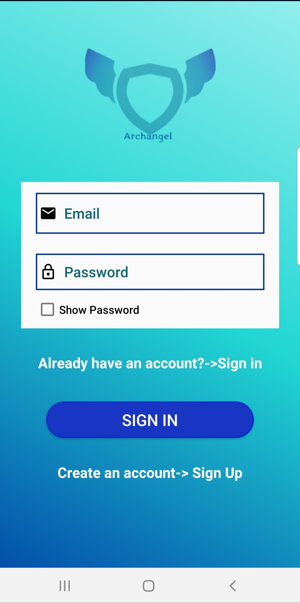
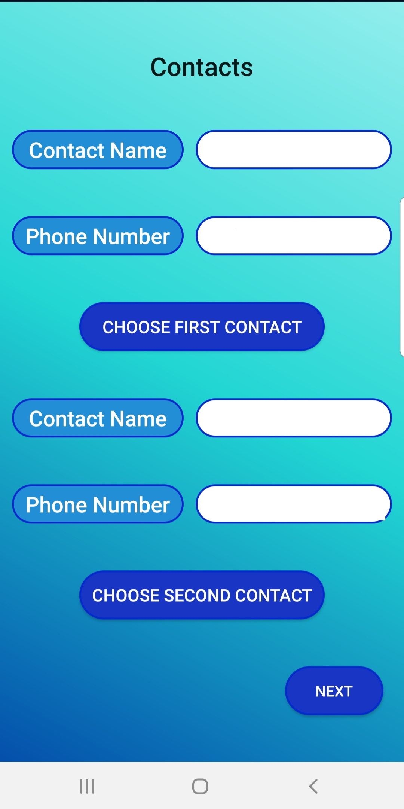
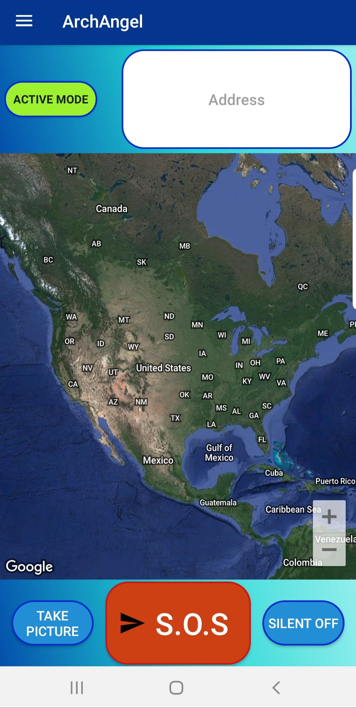

# Project Title

> Personal safety Android Application – Archangel

## Prerequisite 1

- The app runs off a Firebase backend. You will need to generate your firebase backend.

- Navigate to [Firebase](https://firebase.google.com/) and sign up. Create a project called "Archangel".

- Connect your Android app to Firebase following one of the two options.

- [Add Firebase to your Android project](https://firebase.google.com/docs/android/setup#console)

- You will need to generate your own google-services.json file to use with the app.

## Prerequisite 2

- The app uses a Map SDK for Android. The Application needs an API key to access the Google Maps server.

- Navigate to Google Maps Plataform and follow the steps to get a Gogle Maps API key

- [Get a Google Maps API key](https://developers.google.com/maps/documentation/android-sdk/start)

## Setup

- After creating  a New Project on Android Studio

- Add your API key to AndroidManifest.xml

```xml
<meta-data
            android:name="com.google.android.geo.API_KEY"
            android:value="YOUR_API_KEY" />
```

---

## Final Result

<p align="center">



</p>
